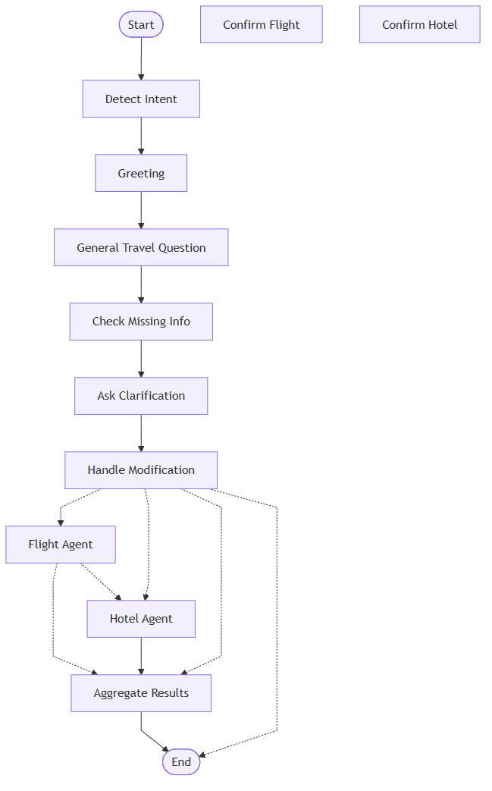

# Friendly Travel Assistant Agent

A multi-agent travel booking assistant built using LangGraph, Streamlit, and the A2A (Agent-to-Agent) communication pattern.

The system includes:

* Orchestrator Agent
* Flight Booking Agent
* Hotel Booking Agent
* Streamlit Chat Interface

The assistant supports multi-turn travel planning, flight booking, hotel recommendations, destination modifications, and general travel advice.

---

# Features

## Flight Booking

Supports:

* One-way trips
* Round-trip flights
* Passenger count
* Cabin class selection
* Flight confirmation flow

Examples:

* Travel from Chennai to Tokyo
* Travel from Chennai to Tokyo on 19 June
* Travel from Chennai to Tokyo on 19 June for 2 passengers
* Travel from Chennai to Tokyo on 19 June returning on 24 June

---

## Hotel Booking

Supports:

* Hotel recommendations after flight booking
* Hotel search near preferred locations
* Hotel selection confirmation
* Hotel modification requests

Examples:

* Find me a hotel in Tokyo
* Hotel near Shinjuku
* Change hotel to Shinjuku Granbell Hotel

---

## Travel Modifications

Supports modifying existing bookings.

Examples:

* Change destination to Paris
* Switch hotel to Hilton Tokyo

---

## General Travel Questions

Supports travel advice without triggering booking workflows.

Examples:

* Is this a good time to visit Tokyo?
* Is June a good time to visit Paris?
* What are some places to visit in Tokyo?

---

## Repository Structure

friendly-travel-agent/

├── orchestrator/

│ ├── agent.py

│ ├── extractor.py

│ ├── prompts.py

│ └── state.py

├── agents/

│ ├── flight_agent/

│ └── hotel_agent/

├── interface/

│ └── app.py

├── docs/

│ └── architecture.md

├── requirements.txt

├── README.md

└── .env

---

# Setup

## Clone Repository

```bash
git clone <repository-url>
cd friendly-travel-agent
```

## Create Virtual Environment

```bash
python -m venv venv
```

Windows:

```bash
venv\Scripts\activate
```

Mac/Linux:

```bash
source venv/bin/activate
```

## Install Dependencies

```bash
pip install -r requirements.txt
```

## Configure Environment Variables

Create .env

```env
GROQ_API_KEY=your_groq_api_key
```

## Run Application

```bash
streamlit run interface/app.py
```

---

## Demo Prompts

### Flight Booking

Travel from Chennai to Tokyo

Tomorrow

2

Economy

### Round Trip

Travel from Chennai to Tokyo on 19 June returning on 24 June

3

Business

### Destination Change

Travel from Chennai to Tokyo

Change destination to Paris

### Travel Advice

Is it a good time to visit Tokyo?

Is June a good time to visit Paris?

### Hotel Flow

Travel from Chennai to Paris on 19 June returning on 24 June

2

Economy

Yes

Select hotel 1

Confirm

---

# Technologies Used

* Python
* Streamlit
* LangGraph
* LangChain
* Groq LLM
* A2A Communication Pattern

---

## LangGraph Workflow



---

# Future Improvements

* Real flight APIs
* Real hotel APIs
* Calendar integration
* User authentication
* Persistent booking history
* Multi-city itineraries

---

# Author

Shubha
