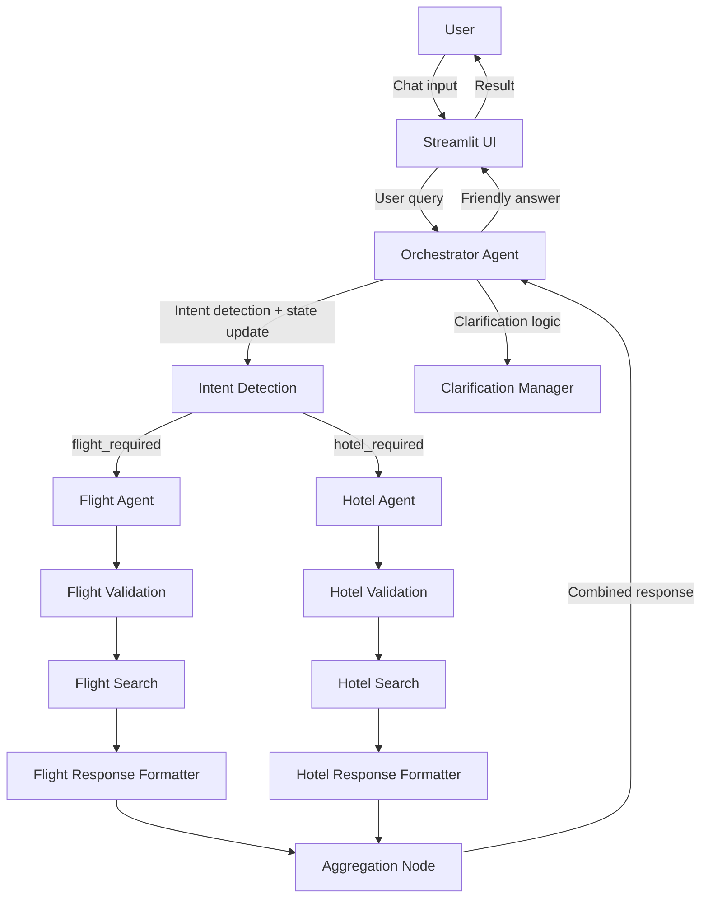

# Friendly Assistant Agent Architecture

This document describes the multi-agent travel booking system built for the Friendly Assistant Agent assignment.
The architecture uses a LangGraph-based orchestration pattern with a single user-facing Orchestrator and two specialised A2A sub-agents: Flight and Hotel.

## System Overview

The system is designed around three main layers:

- **User Interface**: A Streamlit chat UI that accepts natural language travel requests and displays friendly results.
- **Orchestrator Agent**: The single user-facing LangGraph StateGraph that manages conversation state, intent parsing, clarifications, and delegation.
- **Sub-agents**: Flight Agent and Hotel Agent, each implemented as its own LangGraph StateGraph and communicating with the orchestrator via the A2A protocol.

## High-level workflow



## Component responsibilities

### Orchestrator Agent

The Orchestrator is the only component that interacts with the user directly.
It is responsible for:

- maintaining session-level `TravelState`
- extracting and merging travel parameters from user text
- tracking pending clarifications and follow-up questions
- deciding whether to delegate to the Flight Agent, Hotel Agent, both, or neither
- aggregating and formatting results from sub-agents
- answering general travel questions directly when no booking delegation is required

The orchestrator state includes:

- `conversation_history`
- `travel_parameters`
- `pending_clarification`
- `flight_response`
- `hotel_response`
- `selected_flight` and `selected_hotel`
- boolean flags like `flight_required`, `hotel_required`, `is_general_question`, and `is_modification_request`

### Flight Agent

The Flight Agent is specialised for flight search tasks and only handles A2A requests.
Its internal StateGraph contains nodes for:

- input validation
- mock flight search logic
- response formatting

It receives a structured A2A task request with fields such as `origin`, `destination`, `departure_date`, `return_date`, `passengers`, and `cabin_class`.

### Hotel Agent

The Hotel Agent is specialised for hotel search tasks and only handles A2A requests.
Its internal StateGraph contains nodes for:

- input validation
- mock hotel search logic
- response formatting

It receives a structured A2A task request with fields such as `destination_city`, `check_in_date`, `check_out_date`, `guests`, `room_type`, and `location_preference`.

## A2A Protocol

The orchestrator and sub-agents communicate using a consistent request/response schema.
The A2A protocol is defined in `agents/*/schemas.py`.

### Task Request Schema

```json
{
  "task_id": "uuid-string",
  "task_type": "flight_search | hotel_search",
  "session_id": "uuid-string",
  "parameters": {
    "origin": "SIN",
    "destination": "TYO",
    "departure_date": "2025-06-15",
    "return_date": "2025-06-20",
    "passengers": 1,
    "cabin_class": "economy"
  },
  "metadata": {
    "requested_by": "orchestrator",
    "timestamp": "ISO-8601"
  }
}
```

### Task Response Schema

```json
{
  "task_id": "uuid-string",
  "status": "success | partial | failed | needs_clarification",
  "results": [],
  "clarification_needed": null,
  "error": null,
  "metadata": {
    "agent_id": "flight-agent | hotel-agent",
    "timestamp": "ISO-8601"
  }
}
```

## Workflow details

1. **User sends a request**.
2. **Orchestrator extracts details** from text and updates `travel_parameters`.
3. **Orchestrator checks completeness**.
   - If required fields are missing, it uses `pending_clarification` to ask follow-up questions.
   - If the user asked a general travel question, it responds directly.
4. **Orchestrator sends A2A requests** to sub-agents.
5. **Sub-agents validate and search mock data**.
6. **Sub-agents return structured responses**.
7. **Orchestrator aggregates results** and sends a friendly summary back to the UI.

## Multi-turn conversation handling

The system supports:

- full-detail requests
- partial requests that trigger clarifying questions
- booking flow switchovers (flight-only, hotel-only, or both)
- destination changes mid-conversation
- round-trip flights with hotel dates inferred from flight dates
- friendly failure handling when no mock results are available

## Visualization

The Mermaid diagram above captures the main data flow and agent responsibilities.

For a more complete submission, include the diagram alongside the following implementation facts:

- `orchestrator/agent.py` is the primary LangGraph `StateGraph`
- `agents/flight_agent/agent.py` and `agents/hotel_agent/agent.py` are independent sub-agent graphs
- `interface/app.py` is the Streamlit chat UI entry point

## Notes for reviewers

- The orchestrator acts as a router and session manager, not as a direct business logic engine.
- The sub-agents implement reusable A2A task processing and can be unit tested independently.
- The architecture is intentionally modular to make the flight and hotel agents replaceable without changing the orchestration flow.

