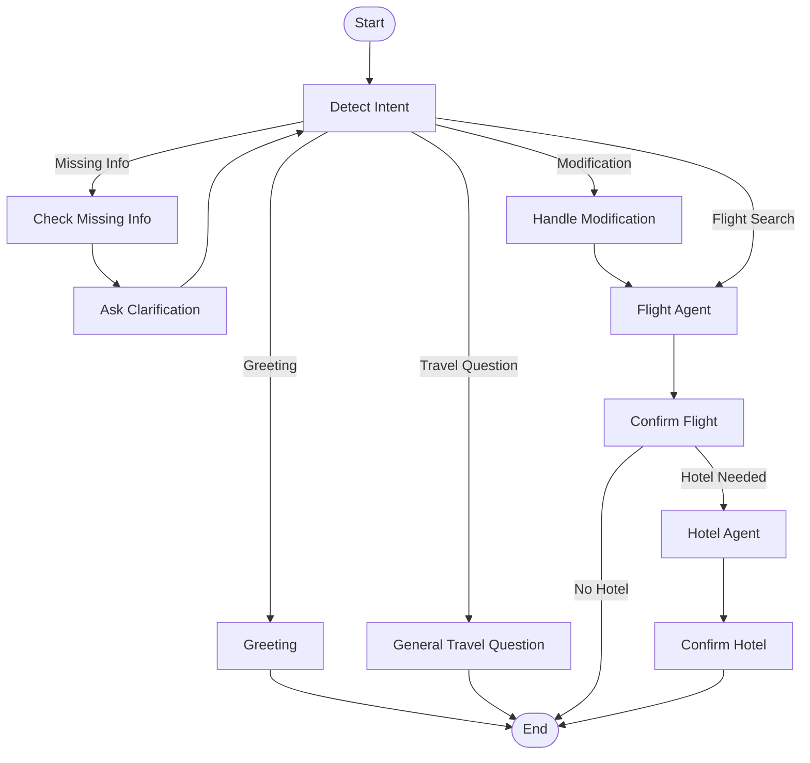

# Friendly Travel Assistant Architecture

## Overview

The system follows a multi-agent architecture built using LangGraph.

A single Orchestrator Agent manages the conversation and delegates travel-related tasks to specialized agents.

---

## Architecture Diagram

mermaid
flowchart TD

    User[User]

    UI[Streamlit Chat UI]

    Orchestrator[Orchestrator Agent]

    Extractor[Travel Detail Extractor]

    FlightAgent[Flight Agent]

    HotelAgent[Hotel Agent]

    GeneralQA[Travel Advice Handler]

    User --> UI

    UI --> Orchestrator

    Orchestrator --> Extractor

    Extractor --> Orchestrator

    Orchestrator --> FlightAgent

    Orchestrator --> HotelAgent

    Orchestrator --> GeneralQA

    FlightAgent --> Orchestrator

    HotelAgent --> Orchestrator

    GeneralQA --> Orchestrator

    Orchestrator --> UI

    UI --> User

---

## LangGraph Workflow

---

## Orchestrator Agent

Responsibilities:

* Maintain TravelState
* Extract travel parameters
* Ask clarification questions
* Track conversation progress
* Handle modifications
* Delegate to Flight Agent
* Delegate to Hotel Agent
* Handle general travel questions
* Aggregate responses

State includes:

* origin
* destination
* departure_date
* return_date
* passengers
* cabin_class
* needs_hotel
* selected_flight
* selected_hotel
* pending_clarification

---

## Flight Agent

Responsibilities:

* Validate search request
* Search mock flight inventory
* Format flight options
* Handle flight confirmation

Inputs:

* origin
* destination
* departure_date
* passengers
* cabin_class

Outputs:

* flight recommendations
* selected flight
* booking confirmation

---

## Hotel Agent

Responsibilities:

* Search hotels
* Recommend hotels
* Handle hotel selection
* Handle hotel modifications

Inputs:

* destination
* check-in date
* check-out date
* location preference

Outputs:

* hotel recommendations
* selected hotel
* hotel confirmation

---

## Travel Detail Extraction

The extractor supports:

### Route Detection

* Chennai → Tokyo
* Bangalore → Singapore

### Date Detection

* Tomorrow
* Today
* Next Friday
* 19 June
* 24 June

### Round Trip Detection

Travel from Chennai to Tokyo on 19 June returning on 24 June

### Passenger Detection

* 2 passengers
* 4 travellers

### Cabin Detection

* Economy
* Business
* First
* Premium Economy

### Modification Detection

* Change destination to Paris
* Replace hotel with Hilton Tokyo

---

## General Travel Questions

Handled directly by the Orchestrator without invoking booking agents.

Examples:

* Is this a good time to visit Tokyo?
* Is June a good time to visit Paris?
* What should I visit in Tokyo?

---

## Current Supported Workflows

### Workflow 1

Multi-turn Flight Booking

User → Route → Date → Passengers → Cabin → Flight Results

### Workflow 2

Round Trip Booking

User → Complete Trip Details → Flight Results

### Workflow 3

Destination Modification

User → Change Destination → Updated Flight Search

### Workflow 4

Flight Confirmation

User → Select Flight → Confirm Flight

### Workflow 5

Travel Advice

User → Travel Question → Advice Response

### Workflow 6

Flight + Hotel Booking

User → Flight Search → Flight Confirmation →
Hotel Recommendation → Hotel Confirmation →
Final Booking Summary

---

## A2A Communication

The Orchestrator communicates with Flight and Hotel Agents through structured request/response payloads.

Benefits:

* Loose coupling
* Independent agent testing
* Easy replacement of agents
* Scalable architecture

---

## Future Enhancements

* Real flight providers
* Real hotel providers
* Agent memory persistence
* Multi-city travel planning
* Travel budget optimization
* Weather-aware recommendations
